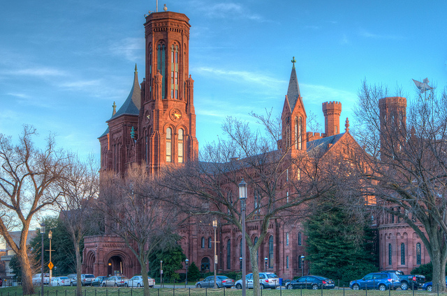

# F2F Meeting in Washington, DC, USA, February 7-8, 2019

## Agenda, Participants

See [working document](https://docs.google.com/document/d/11agKfDU1vTjyKBI_ytLBYFChFCqEfFePNVposnmSW_8/edit)

## Meeting Minutes

* 02-07: t.b.d.
* 02-08: t.b.d.

<figure style="margin:0">
  
  <figcaption>
    The Smithsonian Castle
    
    photo by <a rel="external" href="https://www.flickr.com/photos/procario/11060000573/">procario</a>
  </figcaption>
</figure>
